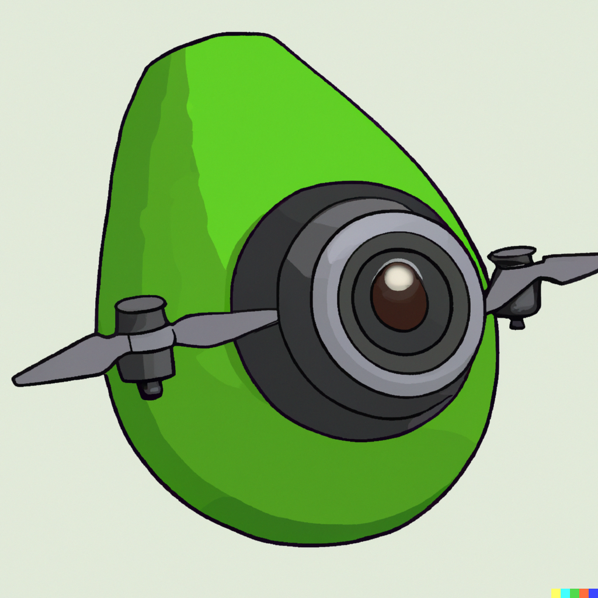

# Avocadrone

  

## Overview
The Avocado Picking Drone project aims to develop an autonomous drone system capable of efficiently and accurately picking ripe avocados from avocado groves. By combining computer vision, robotics, and artificial intelligence, this project aims to revolutionize the avocado harvesting process, improving efficiency, reducing labor costs, and minimizing fruit damage.

## Project Description
The project involves the design, development, and implementation of a drone system that can identify and selectively pick ripe avocados from trees. The drone will utilize advanced computer vision algorithms to analyze avocado color, shape, and size, enabling it to distinguish ripe avocados from unripe ones. Once identified, the drone will maneuver its robotic arm to gently pick the ripe avocados without causing any damage to the fruit or the tree.

## Objectives
* Develop computer vision algorithms to accurately detect ripe avocados based on visual cues, such as color, texture, and size.
* Implement robotic arm control mechanisms to facilitate the gentle picking of avocados without causing harm to the fruit or the tree.
* Integrate navigation systems, including GPS and obstacle detection, to enable autonomous flight and safe operation within the avocado orchard.
* Incorporate machine learning techniques to enhance the drone's avocado detection and picking capabilities over time, improving accuracy and efficiency.
* Conduct rigorous testing and evaluation to ensure the drone system's reliability, precision, and performance in real-world avocado orchard environments.
## Expected Benefits
1. Increased Efficiency: The autonomous drone system will significantly reduce the time and effort required for avocado harvesting compared to manual picking methods, leading to increased operational efficiency for farmers.
2. Improved Quality: By selectively picking only ripe avocados, the drone system will enhance the overall quality of the harvested fruit, reducing waste and improving market value.
3. Cost Savings: The automation of avocado picking will reduce labor costs associated with manual labor, providing a cost-effective solution for avocado farmers.
4. Sustainability: By minimizing fruit damage and optimizing harvesting techniques, the project aims to promote sustainable farming practices in the avocado industry
5. Scalability: The developed drone system can be scaled and adapted for use in different orchard environments and potentially extended to other crop harvesting applications.
## Repository Structure
- `src/`: Contains the source code for the drone's computer vision algorithms, robotic arm control, navigation systems, and machine learning components.
- `datasets/`: Includes sample datasets and annotated images used for training and testing the avocado detection and picking models.
- `docs/`: Provides detailed documentation, including instructions for setup, system architecture, and usage guidelines.
- `examples/`: Offers example scripts and notebooks demonstrating the usage and integration of different components of the avocado picking drone system.
## Requirements
Detailed hardware and software requirements for running and developing the avocado picking drone system will be provided in the documentation.
